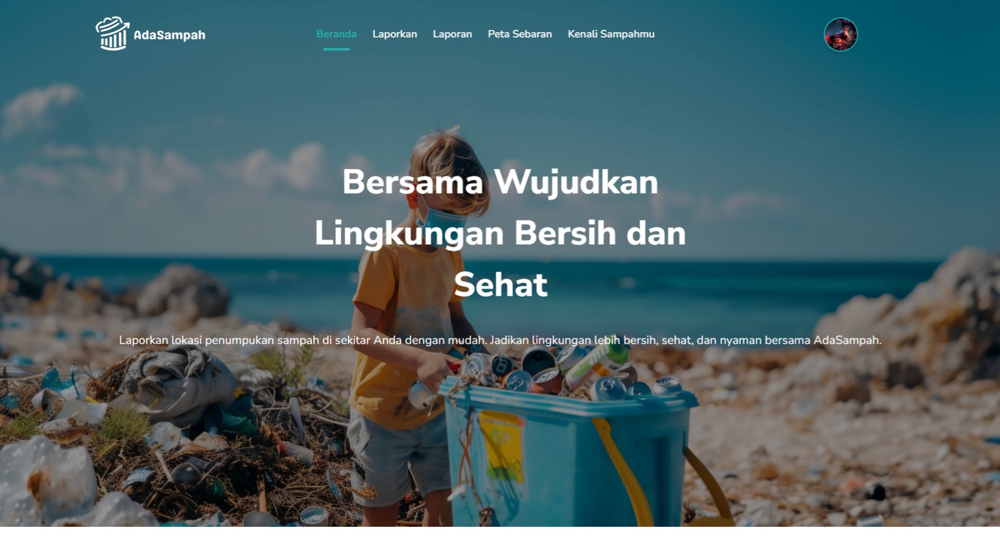
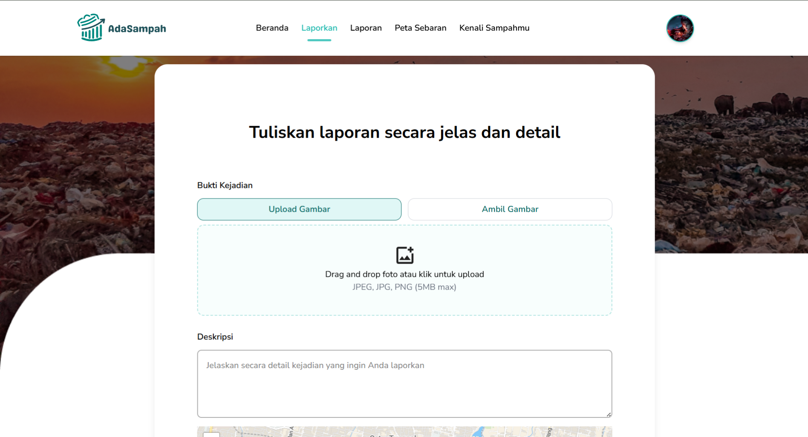
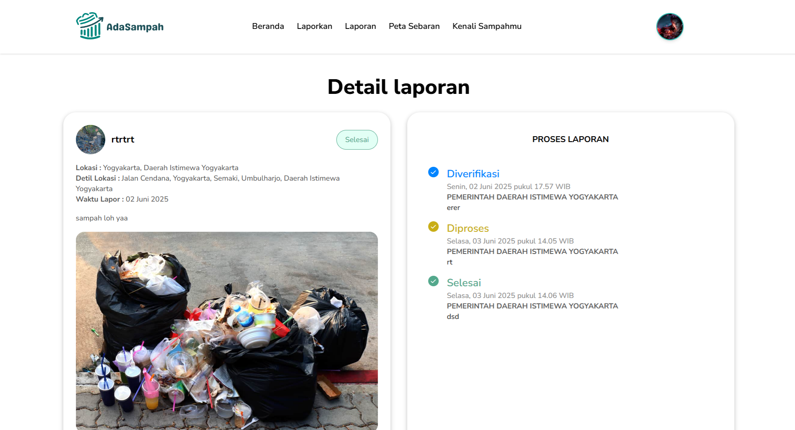
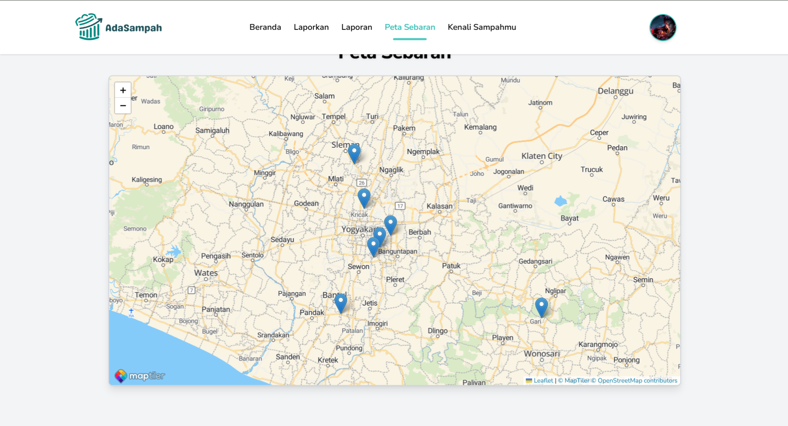
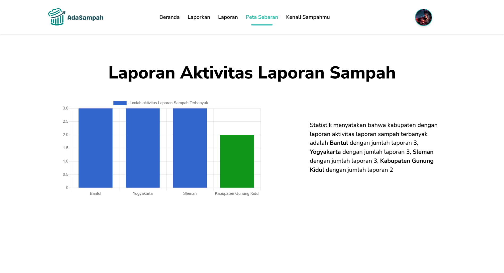

<div align="center">
  

  <h2 style="margin-top: 0; color: #2e7d32; font-size: 2rem; font-weight: bold; text-shadow: 1px 1px 6px #b2dfdb; letter-spacing: 1px;">AdaSampah: Ada sampah? Laporin aja!</h2>
</div>

# AdaSampah

AdaSampah adalah platform inovatif yang menghubungkan masyarakat dengan pemerintah untuk bersama-sama mewujudkan lingkungan yang bersih dan lestari. Melalui fitur unggulan <b>"Kenali Sampahmu"</b>, pengguna dapat mengunggah foto sampah dan secara otomatis memperoleh informasi jenis, solusi penanganan, hingga inspirasi pemanfaatan kreatif dari sampah tersebut. Jadikan setiap laporan dan aksi Anda bagian dari perubahan nyata menuju pengelolaan sampah yang cerdas, edukatif, dan berkelanjutan.

## Fitur Utama

- **Pelaporan Sampah Liar**: Laporkan penemuan sampah liar atau pembuangan sembarangan secara mudah dan cepat.
- **Kenali Sampahmu**: Identifikasi jenis sampah melalui foto dan dapatkan solusi penanganan serta inspirasi pemanfaatan.
- **Edukasi & Inspirasi**: Dapatkan tips, edukasi, dan inspirasi pengelolaan sampah yang ramah lingkungan.
- **Peta Sebaran Sampah**: Lihat sebaran laporan sampah di wilayah Anda secara interaktif.
- **Kolaborasi Masyarakat & Pemerintah**: Wujudkan lingkungan bersih melalui kolaborasi nyata.
- **Profil & Riwayat Laporan**: Kelola profil dan pantau riwayat laporan Anda.

## Demo

<!-- Ganti link di bawah ini dengan link demo/deploy website Anda -->

[Demo Website AdaSampah](#)

## Instalasi & Pengembangan

1. **Clone repository ini**
   ```bash
   git clone <url-repo-anda>
   cd AdaSampah-FEBE
   ```
2. **Install dependencies**
   ```bash
   npm install
   ```
3. **Jalankan aplikasi secara lokal**
   ```bash
   npm run dev
   ```
4. **Build untuk produksi**
   ```bash
   npm run build
   npm run preview
   ```

> **Catatan:**
>
> - Pastikan sudah mengatur variabel lingkungan (jika ada) dan backend sudah berjalan.
> - Untuk pengaturan base URL backend, cek file `src/config.js`.

## Struktur Folder

```
├── public/
│   ├── icon-192x192.png
│   ├── images/
│   └── ...
├── src/
│   ├── assets/
│   ├── components/
│   ├── context/
│   ├── pages/
│   ├── utils/
│   └── ...
├── App.jsx
├── config.js
├── vite.config.js
└── ...
```

## Screenshot

<!-- Ganti/Update link screenshot di bawah ini sesuai tampilan website Anda -->

| Beranda                                     | Fitur Kenali Sampahmu                               | Peta Sebaran                                     | Edukasi                                     | Profil                                     |
| ------------------------------------------- | --------------------------------------------------- | ------------------------------------------------ | ------------------------------------------- | ------------------------------------------ |
|  |  |  |  |  |

## Kontribusi

Kontribusi sangat terbuka! Silakan fork repository ini, buat branch baru, dan ajukan pull request.

## Lisensi

<!-- Ganti dengan lisensi yang Anda gunakan, misal MIT, GPL, dsb -->

Lisensi: MIT

---

> **Catatan:**
>
> - Update bagian demo, screenshot, dan lisensi sesuai kebutuhan Anda.
> - Jika ada fitur baru, tambahkan pada bagian Fitur Utama.
